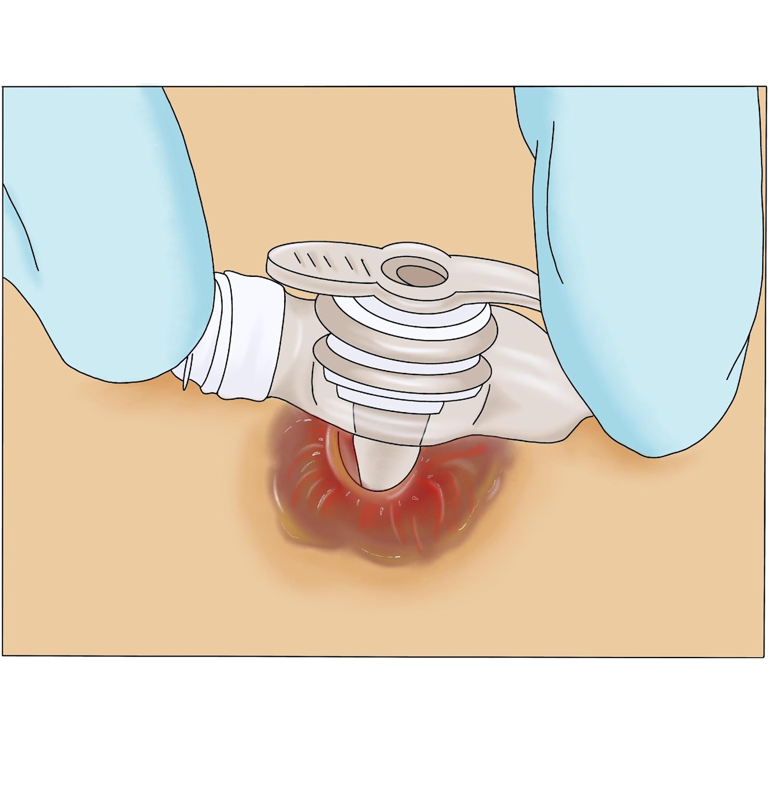

Entre as complicações mais comuns estão: 

* Granulomas: crescimento de tecido (estimulado pela umidade local), de coloração róseo-avermelhada, que fica elevado através do orifício onde está a gastrostomia. Geralmente sangra com facilidade, mas se este sangramento persistir, procure o médico ou o serviço de referência. Para prevenir seu surgimento e crescimento, deve-se evitar a umidade no local e não realizar  movimento excessivo no cateter/*botton*.
* Vazamento ao redor da gastrostomia: pode ocorrer o vazamento de dieta ou de líquidos do estômago (suco gástrico). As causas podem ser pelo tamanho inadequado do dispositivo utilizado, mau posicionamento, quantidade insuficiente de água no balonete interno e distensão do estômago. 
* Perda acidental do cateter/*botton*: pode ocorrer pela estabilização inadequada do dispositivo ou pela retirada acidental pela criança ou cuidador, ou por ruptura do balonete interno. Neste caso a criança deve ser encaminhada imediatamente ao pronto atendimento, pois o estoma pode se fechar. 
* Caso a pele esteja com alguma lesão, ou ocorra vazamento persistente de dieta pelo orifício do cateter, encaminhar a criança ao médico para tratamento.
* Nunca utilize cremes, pomadas ou medicações por conta própria (somente com orientação médica ou do enfermeiro estomaterapeuta).

