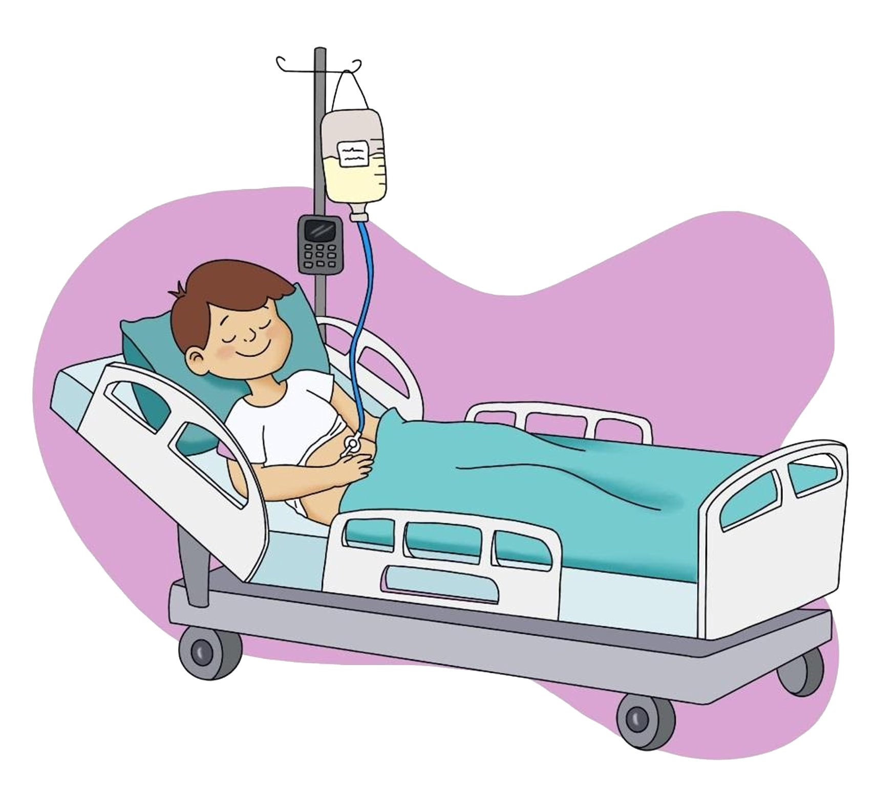

* Higienize as mãos com água e sabão antes da manipulação.
* A dieta deve ser administrada sempre em temperatura ambiente.
* Siga corretamente os horários e o tempo de administração prescritos pelo seu médico ou nutricionista.
* Se a criança tiver *botton*, encaixar sua extensão para administrar a dieta, sempre higienizando com água filtrada após o uso, mantendo em local seco e limpo. 
* Mantenha a criança sentada ou com travesseiro nas costas, com a cabeceira da cama elevada sempre que a dieta, água ou medicação estiverem sendo administradas, para evitar episódios de enjoo ou vômito.

* A dieta por gotejamento ou por seringa deve ser administrada lentamente para evitar diarréia, aumento abdominal (distensão abdominal) e vômitos. 
* Quando terminar a infusão da dieta, mantenha a criança nesta posição por cerca de 40 minutos para evitar vômitos e/ou refluxo (regurgitação) da dieta.
* Após administração de dieta e medicamentos, o cateter ou *botton* deverá ser lavado com água filtrada. Essa lavagem deverá ser feita com seringa para realizar uma pressão que evite o acúmulo de resíduos no dispositivo. A quantidade de água para esta lavagem é prescrita pelo médico ou nutricionista.
* Se durante a administração da dieta a criança apresentar enjoo ou vômito, a infusão deve ser parada. Verifique se a posição da criança está correta (cabeceira elevada), se o abdômen está distendido e aguarde melhora. Caso o vômito não pare, encaminhe a criança ao pronto atendimento mais próximo.
* Sempre que a gastrostomia não estiver sendo utilizada sua pinça deve estar fechada. No caso de *botton*, também deve estar sempre fechado.
* Se a dieta estiver vazando ao redor do cateter, procure o serviço médico ou de referência
* Os medicamentos devem ser administrados em horários diferentes das dietas. Caso seja necessário medicar a criança no mesmo horário, pare a dieta, lave a sonda com água filtrada, faça a medicação, lave a sonda novamente e continue administrando a dieta. Nunca administre comprimidos ou medicações em pó sem diluir. Eles poderão entupir a sonda. 
* Atente sempre para a limpeza adequada e período de validade dos frascos de dieta, seringas e equipos utilizados. Siga sempre a indicação do enfermeiro e nutricionista. 
