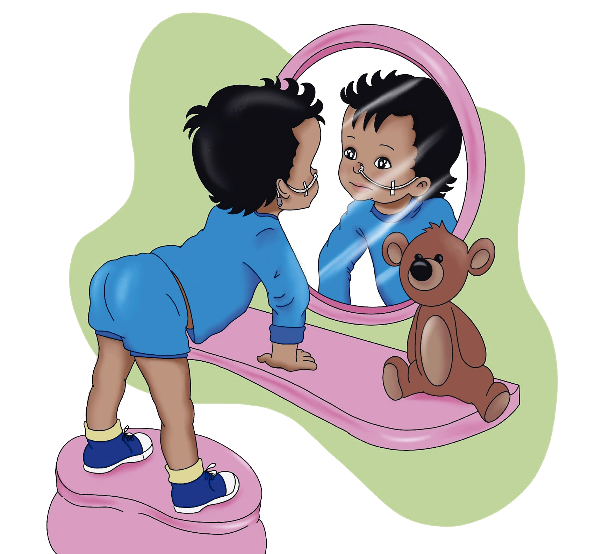

É uma abertura cirúrgica que comunica o estômago ao meio externo, fixada à pele da parede abdominal através da introdução de um cateter, com o objetivo de administrar alimentos, medicamentos e líquidos.

Atualmente existem dois tipos de dispositivos, o botton e o cateter de gastrostomia. A gastrostomia é realizada através de um procedimento cirúrgico ou endoscópico, com uso de anestesia. A substituição do cateter pelo botton pode ser feita no centro cirúrgico ou ambulatorialmente, dependendo da indicação médica, da disponibilidade na instituição ou da compra do dispositivo pela família.

**Por que que tenho uma Gastrostomia?**

Geralmente é indicada para crianças que perderam a capacidade de ingerir alimentos, devido a condições congênitas ou traumáticas e pode ser temporária ou definitiva. Ela também pode ser indicada para crianças com a via oral funcionante e capacidade de deglutição preservada, mas insuficiente para manter o aporte hídrico e/ou nutricional adequados, sendo necessária por tempo prolongado. A gastrostomia substitui o uso do cateter enteral, aquele que é colocada pelo nariz. Essa troca auxilia na prevenção de problemas devido ao uso prolongado do cateter, como irritação na garganta (laringe), lesões dentro do nariz, sinusite, aumento do refluxo (regurgitação) de secreção do estômago.

A gastrostomia proporciona melhor qualidade de vida, diminui o risco de pneumonias aspirativas, refluxo da dieta e desnutrição, que são causadas pela dificuldade do ato de engolir. 

Através da gastrostomia pode ser administrado um volume maior de alimentação, de forma mais prática e segura, podendo ser realizada pelo cuidador ou até pela própria pessoa com a gastrostomia. A manipulação do cateter de gastrostomia ou do botton é fácil, além de serem mais discretos que o cateter localizado no nariz ou boca.

