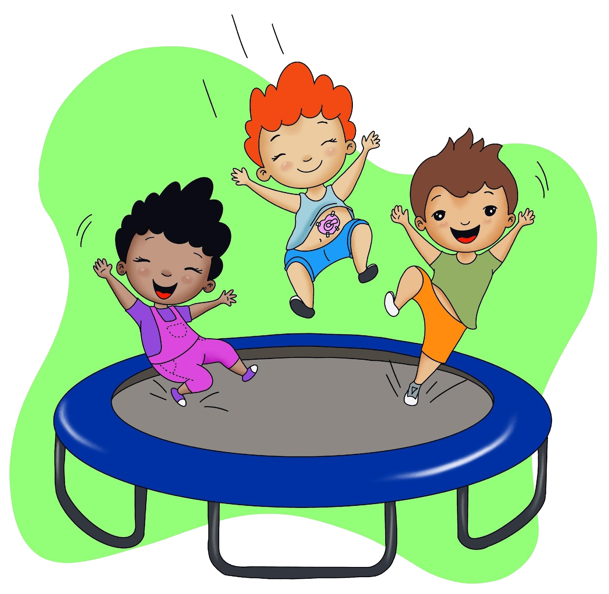

A criança com gastrostomia demanda de seus familiares/cuidadores, cuidados específicos com o manuseio do cateter/botton todos os dias. Esses cuidados devem ser aprendidos no hospital (antes da alta), acompanhados depois em casa e em programa especializado.

A criança com gastrostomia pode praticar atividades físicas leves, como correr, pular e aquelas que não apertem a gastrostomia e região abdominal.  Além disso, pode realizar atividades diárias de seu costume como brincar e estudar. Mas para isso, é importante conversar com profissionais (especializados) sobre a condição de cada criança e seus limites. Para usar a piscina, deverá antes conversar com seu médico. Caso ele autorize, a gastrostomia deverá estar sempre fechada e protegida com um curativo impermeável e transparente. 

É importante levar sempre na bolsa, um kit para necessidade de higienização (toalha limpa, caso seja necessário limpar a inserção da sonda, seringa e água filtrada). É recomendável utilizar uma proteção no abdome, como uma faixa feita com um tecido largo (malha ou algodão), e para  alegrar, podemos colocar bordados, adesivos e figuras, proporcionando segurança e conforto. Esta proteção também pode ser feita com a própria roupa da criança, mais aderida ao corpo e sem apertar, pois, a finalidade é de não deixar a sonda solta, o que pode facilitar sua tração e a formação de granuloma. 

Na escola é importante que os professores tenham conhecimento sobre a condição de saúde da criança, além de serem treinados sobre os cuidados necessários com a gastrostomia, como por exemplo sua saída acidental e  situações de emergência. Assim, a escola será um lugar prazeroso para o seu aprendizado. Um verdadeiro espaço de inclusão e cidadania!

A criança deve ser acompanhada por uma equipe multiprofissional: médico, enfermeiro e nutricionista. Eles irão acompanhar crescimento, nutrição e cuidados com a sonda. Para isto seu médico tem que encaminhá-la ao serviço primário de saúde (posto de saúde).

